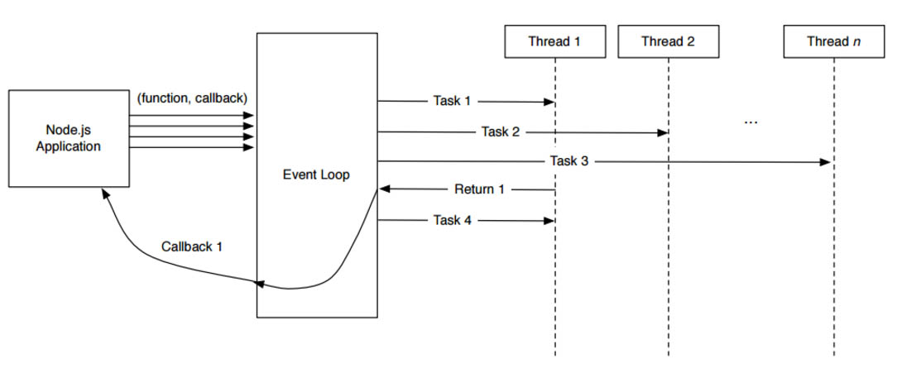

## Les besoins
Le premier aspect auquel nous avons pensé lors de la découverte de ce sujet, est l’asynchronisme. En effet c’est tout le coeur du projet : la complexité à exécuter des algorithmes en parallèles, sans ralentissement.  
Pour un projet web, Node.js est apparu comme une évidence. Véritablement, “Node” est une plateforme construite sur le moteur JavaScript v8 (Google) qui permet de développer des applications avec le langage JavaScript.
Son approche non bloquante le distingue face à la concurrence puisqu’elle permet d’utiliser les entrées et sorties (Input / Output) de manière asynchrone comme le présente ce diagramme.


Outre cet aspect, Node.js est basé sur un système d'événement ce qui signifie que les objets créés émettront des événements tout au long de leur cycle de vie. Un point non négligeable en vue du sujet.




## Technologies utilisées
Pour développer ce projet nous avons utilisé diverses libraries allant du front-end jusqu'au watcher de JavaScript.

### node.js


### NPM

NodeJS dispose d'une large communauté qui partage ses modules au travers du gestionnaire de paquet [NPM](https://www.npmjs.com/). Il permet ainsi de télécharger rapidement un module mais aussi ses différentes dépendances.

On commencera par initialiser npm via la commande `$ npm init`, ce qui aura pour effet de créer un fichier package.json qui permettra de suivre les modules à importer. Une fois notre projet initialisé il est possible de télécharger un module simplement via la commande 
```bash
$ npm install --save <nomDuModule>
```

Outre cet aspect de dépendances, NPM permet également de pré-définir des scripts d'exécution du type:
```bash
$ npm run monScript
```

Ce script est déclaré dans le fichier [package.json](https://github.com/TPCISIIE/WebLab/blob/master/package.json) crée précédemment sous la forme suivante:
```
  "scripts": {
    "monScript": "echo \"Exécution de mon script !\" && exit 1"
  },
```
