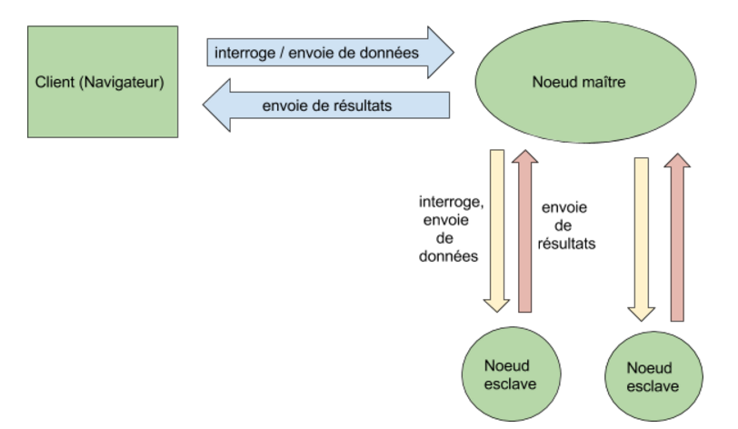

En plus de cet aspect, notre application est gérée en différentes sections : le serveur principal est un noeud maître contenant plusieurs noeuds : noeuds-esclaves, ces derniers ont pour rôle d'exécuter les algorithmes envoyés par l’utilisateur.

