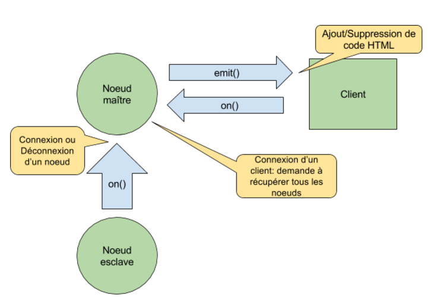

La gestion des noeuds s'effectue par le biais du design pattern Observateur, implémenté par Socket.io.

Socket.io une librairie qui se base sur plusieurs techniques différentes qui permettent la communication en temps réel, la plus connue d'entre elles, et la plus récente, est WebSocket (apparue plus ou moins en même temps que HTML5, c'est une API JavaScript). WebSocket est une fonctionnalité supportée par l'ensemble des navigateurs récents. Elle permet un échange bilatéral synchrone entre le client et le serveur.

A chaque connexion/déconnexion d’un noeud esclave, le noeud maître va être notifié et va alors mettre à jour sa liste de noeud esclaves en suivant ce modèle : 

La fonction on() va prévenir/alerter le noeud maître lors d’un événement d’un noeud esclave (connexion ou déconnexion) qui va ensuite notifier le client grâce à la fonction emit(). 

Si un client se connecte après cette opération il pourra tout de même recevoir la liste des noeuds connectés à l'application en envoyant simplement un signal indiquant au noeud maître qu'il faut lui envoyer cette liste.
