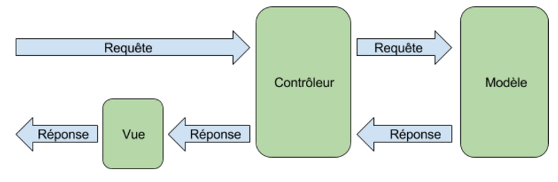
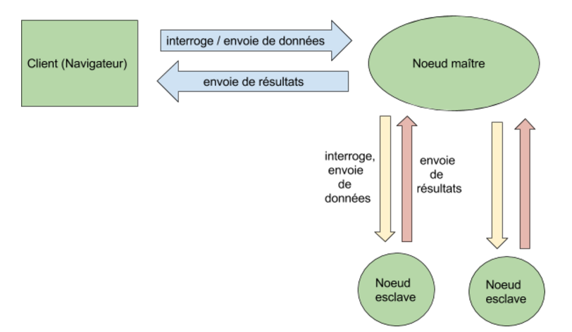

Pour ce projet, nous avons décidé d’adopter une approche classique et présente sur de nombreux sites et applications web : le design-pattern Modèle Vue Contrôleur.
Il y a ainsi une distinction entre les modèles (données), les vues (affichage) et les contrôleurs (logique). 
Le diagramme ci-dessous démontre comment ce design-pattern agit lors d’une boucle requête/réponse :

En plus de cet aspect, notre application est gérée en différentes sections : le serveur principal est un noeud maître contenant plusieurs noeuds : noeuds-esclaves, ces derniers ont pour rôle d'exécuter les algorithmes envoyés par l’utilisateur.

