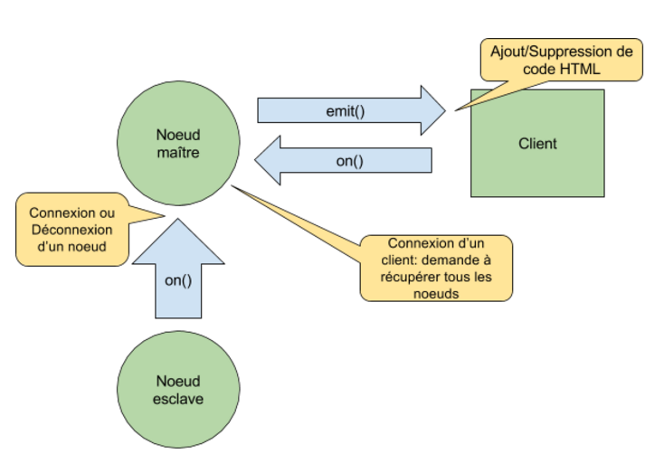

## Implémentation du temps réel
Dû aux besoins de notre application, la gestion des noeuds (fonctionnement et communication entre les différents types de noeud) a été développé pour fonctionner en temps réel. Cette fonctionnalité est possible grâce au classique design pattern Observateur, implémenté par [Socket.io](https://webetu.iutnc.univ-lorraine.fr/www/labroche2u/weblab-docs/AnalyseEtConception/Technologies).

## Fonctionnement d'Observateur dans WebLab
Concernant notre application, pour chaque connexion/déconnexion d’un noeud esclave, le noeud maître sera notifié et va ensuite mettre à jour sa liste de noeud esclaves en suivant ce modèle : 

La fonction on() va pouvoir intercepter un évenement tel que la connexion ou déconnexion d'un noeud esclave et pourra alors prévenir les entités écoutantes (appelées listeners) via la fonction emit() qui a pour rôle de les notifier. 

*Note: Si un client se connecte après l'ajout des noeuds il pourra tout de même recevoir la liste des noeuds connectés à l'application en envoyant simplement un signal indiquant au noeud maître qu'il faut lui transmettre cette liste.*
