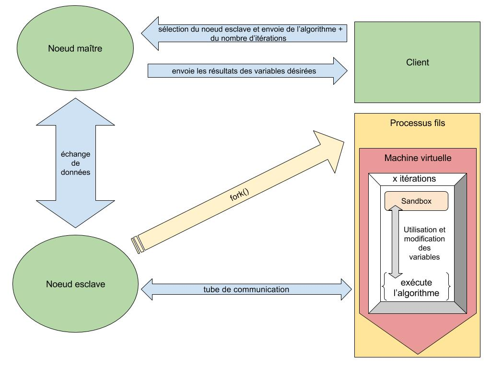

## Envoyer un algorithme
L'exécution d'un algorithme procède en différentes étapes. Tout d'abord l'utilisateur doit rentrer un code JavaScript au format ECMAscript 5.1, le valider puis sélectionner un noeud esclave en indiquant le nombre d'itérations qu'il souhaite effectuer sur ce même algorithme.
Voici un exemple de code conforme pour l'application : 
```javascript
// #output:x
var x = 1;

// #output:y
var y = 5;

x += Math.random();
y += Math.random();

```


## Déroulement
Suite à la première étape, le noeud maître va envoyer via socket.io les données rentrées par l'utilisateur au noeud esclave concerné. Ce dernier va alors créer un processus fils via la fonction fork() d'un script (`Slave/Controllers/AlgoChildProcess.js`) contenant tous les outils nécéssaires à l'exécution de l'algorithme. 

Pour exécuter l'algorithme, le processus fils va créer une machine virtuelle (librairie vm de node.js) puis y injecter le code JavaScript. 
Afin de lancer x fois l'algorithme comme l'utilisateur le souhaite, une boucle d'itérations correspondant au nombre de répétitions demandé sera placé autour de la méthode exécutant l'algorithme.

A chaque fin d'itération des données seront envoyées via un [tube](https://fr.wikipedia.org/wiki/Tube_(shell)) liant le processus père et fils, puis passant par le noeud maître jusqu'au client pour prévenir l'utilisateur de l'avancée de l'exécution du script.
Lors de la dernière itération, les données globales représentant l'ensemble de l'exécution de l'algorithme (toutes les itérations) seront envoyés au client permettant ainsi de faire des graphiques.

L'avantage du fork est de pouvoir prendre controle sur l'exécution globale du script, on pourra ainsi le stopper ou le mettre en pause via des signaux UNIX (fonctions n'existants pas dans les machines virtuelles de node)


## Ciblage de variables et fonctionnement de la Sandbox
Dans notre exemple de code précédent nous avons indiqué en commentaire ``` //#output nomDeVariable ```, cette syntaxe permet de demander à l'application de récupérer à la fin de l'algorithme la valeur de cette variable et de l'injecter dans notre graphique.

### Comment cela fonctionne t-il ?
Lorsqu'un client envoie son script avec le nombre d'itérations et qu'il est transmis au processus fils, ce dernier va parser l'algorithme; quand il va trouver cette syntaxe il va ajouter la variable concernée à la sandbox de la machine virtuelle.

### Une sandbox ?
Une sandbox est un objet JavaScript (JSON) qui va être lié au script avant son exécution. Lors de l'exécution le script va avoir accès à l'objet sandbox via l'[objet global](https://developer.mozilla.org/fr/docs/Web/JavaScript/Reference/Objets_globaux) (objet de portée globale). Ainsi l'algorithme va pouvoir éditer les variables d'un objet externe à la machine virtuelle cela permettra doncd'exploiter l'objet sandbox après l'exécution de celui-ci et de récupérer les nouvelles valeurs de chaque attributs (ici les variables demandées par l'utilisateur).


