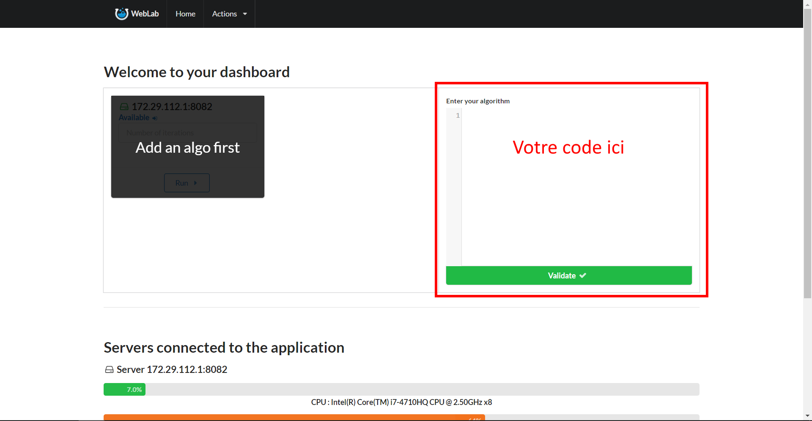

# Avant toutes choses

Pour lancer un algorithme, il est d'abord important d'avoir un noeud esclave de libre pour l'éxecuter, si vous ne savez pas comment faire,
je vous invite à consulter la partie "Obtenir WebLab" du chapitre 2. Pour Commencer.

La première étape consiste donc à insérer le code de l'algorithme voulu dans la partie droite du dashboard, montré par l'image ci-dessous.



# Structure : inputs et outputs

*Input* : A mettre n'importe ou dans le code (avant l'utilsiation de la variable), le input sert à préciser quelles variables doivent conserver leurs valeurs entre les itérations.
Il est possible d'initialiser une valeur input de la sorte : 

```javascript
#input:lenomdevotrevariable=valeur-a-la-premiere-iteration
```

*Output* : A mettre n'importe ou dans le code (avant l'utilisation de la variable), le output sert à définir quelles variables seront utilisées pour l'affichage de statistiques, il est possible de les initialiser de la manière suivante :

```javascript
#output:lenomdevotrevariable
```

(à confirmer) A noter que les input et output peuvent être mis dans n'importe quel ordre, et n'importe ou dans le code, tant que ce dernier est placé avant l'utilisation de la variable associée.