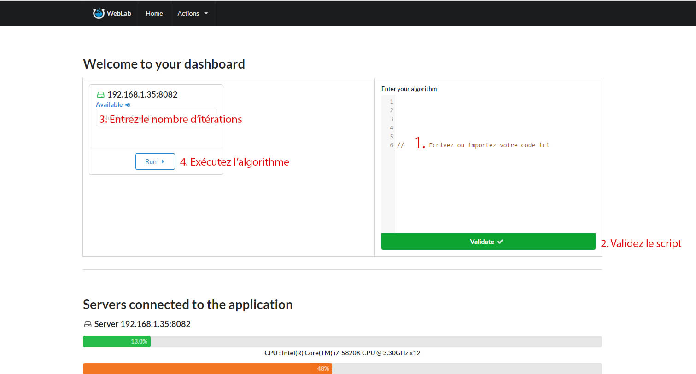

## Préambule

Pour lancer un algorithme, il est d'abord important d'avoir un noeud esclave de libre pour l'éxecuter, si vous ne savez pas comment faire,
je vous invite à consulter la partie du chapitre 2, intitulée *Pour Commencer*.


## Bon usage de l'écriture d'un algorithme
Comme précisé dans le chapitre précédent, l'application WebLab supporte uniquement du code JavaScript allant jusqu'à la version 5.1 d'**EcmaScript** oubliez donc les variables de types ` let ` et fonctions fléchées du type:
```javascript
([param] [, param]) => {
    // Do something...
}
```

L'application n'est pour l'instant pas protégée contre les attaques connues de types fork bomb ou boucles infinies.

### Syntaxe

*Input* : Cette syntaxe sert à préciser quelles variables doivent conserver leurs valeurs entre les itérations.
Il est possible d'initialiser une valeur input de la sorte : 

```javascript
#input:variableName=FirstValueAtFirstIteration
```

*Output* : Cette syntaxe sert à définir quelles variables seront utilisées pour l'affichage de statistiques, il est possible de les initialiser de la manière suivante :

```javascript
#output:variableName
```


## Utilisation de l'application


