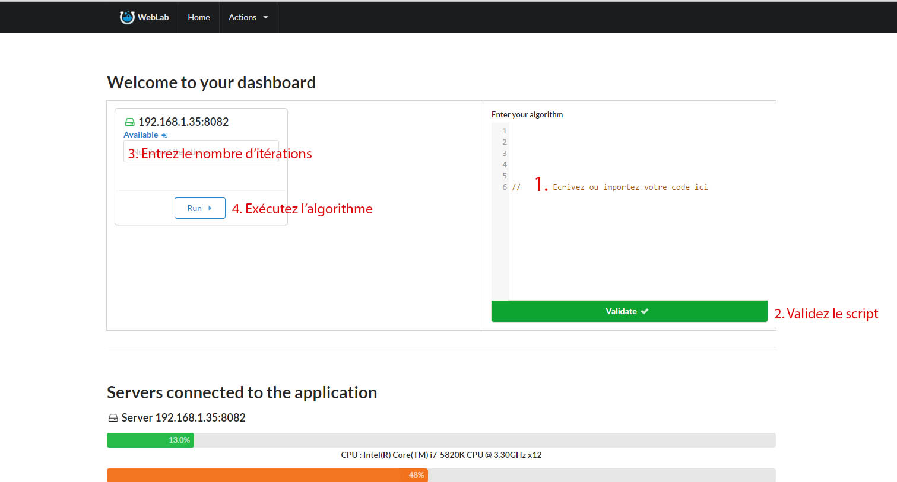

## Préambule
Pour exécuter un algorithme, il est d'abord important d'avoir un noeud esclave de libre pour l'éxecuter, si vous ne savez pas comment faire, veuillez consulter la partie du chapitre 2, intitulée *Pour Commencer*.

## Utilisation de l'application

Ce screenshot indique les actions possibles depuis la page d'accueil pour exécuter un algorithme.

